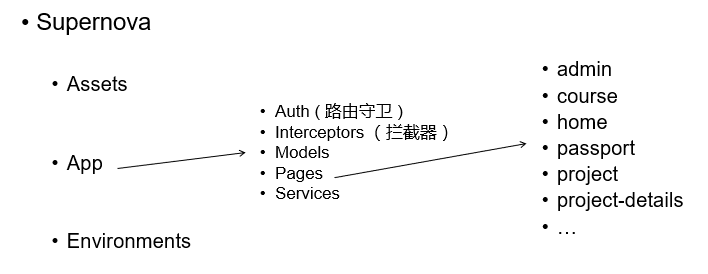
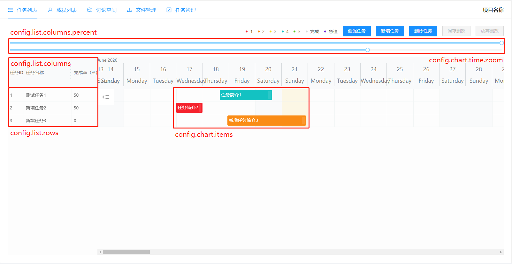

# Supernova PBL System - 超新星项目式学习系统

A course project for Advanced Web Technologies at FDU, Spring 2020. 

> 高级Web技术课程Project - PBL选题


### Group #3 

17302010002 黄元敏 组长

17302010025 李翀

17302010053 张思源

17302010058 王麒迪


## 1 项目设计

### 1.1 项目结构组织及文件说明

#### 1.1.1 前端项目

本项目前端使用了[Angular](https://angular.io/start) 9.1框架，集成使用了[NG ZORRO](https://ng.ant.design/docs/introduce/en) 9.1前端组件库进行组件化开发，甘特图组件使用了GitHub上的项目[Gantt Gantt Gantt Schedule Timeline Calendar](https://github.com/neuronetio/gantt-schedule-timeline-calendar)。

下图所展示的是前端项目`src/`下的文件结构，主要包括：

1. `assets`：项目静态文件夹，如项目logo；

2. `app`：项目主要代码文件夹，其中包括：

   a. `auth`：用于存放项目路由守卫；

   b. `interceptors`：用于存放项目拦截器；

   c. `models`：用于存放前后端交互的传输对象结构；

   d. `pages`：用于存放按页面分类的源代码；

   ​	单个页面为一个文件夹，构成一个Route Module，内部包括组件代码（内部`components/`下）和页面代码；

   e. `services`：用于存放按传输对象分类的服务类，封装了向后端请求数据的方法；

3. `environments`：项目环境变量文件夹，如正向代理的URL配置；



<center>图1 前端项目结构示意图</center>

#### 1.1.2 后端项目

本项目后端使用了助教提供的Spring boot与MyBatis快速搭建[框架](https://github.com/lihengming/spring-boot-api-project-seed)，使用的[Spring boot](https://www.jianshu.com/p/1a9fd8936bd8) 版本为1.5.13，[MyBatis](https://mybatis.org/mybatis-3/zh/index.html)的版本为1.3.1。在开发身份认证功能的过程中使用到了Spring boot AOP插件，并在Maven配置文件中引入了该插件。

下图所展示的是前端项目`src/main`下的文件结构，主要包括：

1. `java/com.SuperNova`

   a. `configurer`：项目部分参数

   b. `core`：项目所需工具类与部分高级抽象接口

   c. `dao`：MyBatis接口

   d. `model`：POJO模型类代码

   e. `service`：service接口与实现类

   f.  `web`：接口控制器与截面类

2. `docker`

   dockerfile

3. `resources`

   a. `mapper`：MyBatis所需映射xml文件

   b. `Setting`：项目相关配置信息


<center>图2 后端项目结构示意图</center>

### 1.2 关键功能实现细节

#### 1.2.1 评分功能设计（附加分功能，前端新建项目对话框、课程评分页面）

`学生总评` = `教师评分`（所有教师评分项Item的得分总和）+ `自评得分` * 自评分占比 + `互评平均分` * 互评分占比 构成。

当未开启自评互评分时，前端将限制进行自评互评操作，后端数据库中将自评互评分占比设置为0，计算时不参与总分的计算。教师评分时只能对以及设定好的每项item进行评分，教师在新建项目时可自定义item的描述和得分占比，评分时在教师的项目管理界面对每个项目中的每个同学针对每个item进行打分。由于可能出现有的同学未进行自评互评的操作，因此为防止这种情况的发生对其他同学的成绩造成影响，采用求已评分成员的平均分作为其互评得分，而不是以项目所有同学作为基数进行计算，此操作在mapper中进行实现。

教师新建项目时必须填充评分细则，保证 `教师得分` + `自评分` + `互评分` = 100，此操作在前端通过表单验证机制进行实现，其中 `教师得分` = 所有评分细则的总分，验证通过后，后端会将所有的评分细则存入`grade_system`数据表中，将其他信息存入`project`表中，评分时教师每评完一个学生的每个item项就会修改该学生对应的`grade_student`表中的表项，当教师评完项目所有学生后，会同时修改`project`表项的评分状态，限制其评分/修改功能。成员自评互评每评完一个人就会在`evaluation`表中新增对应的评分项，评分时自评互评在同一个表中，计算总分时，获取自评和互评的总分是分开的，由mapper进行实现获取自评得分与互评平均分。

在教师未评分之前，可以修改项目评分设定规则，包括增删改操作，修改的内容包括评分细则描述与最高分，自评互评分别占比，教师评分后不能再次对项目评分细则进行修改。评分结束后，会将学生所有成绩（`自评`、`互评`、`教师总分`）全部写入`student_project`表中，此后学生可在该表中查询各自的成绩，若还未评分结束，则学生无法查看自己的成绩，这样的设计很好的避免了学生发出超越权限的请求。

对于评分页面，我们设计了以下加分项：首先是对教师评分页面的表格实现分别按列的排序功能，这样方便了教师查看班级分数的分布情况；其次是实现了教师在表格中按照姓名进行匹配查找的筛选功能，这样方便了教师快速查找到某个具体的学生进行评分；为了提高用户友好性，我们的评分修改框也使用了即点即写的方式，教师只需要点击想要评分的学生的那一行，即可开始修改，可以简化教师的操作；教师评分时，会根据新建项目时设置的评分上限对教师的评分进行限制，如果超出了上限或下限，则会发出警告信息并拒绝修改操作。

当项目处于未提交评分状态时，教师可以选择查看自己教授的课程的某个项目，并对暂未评分的学生进行评分，一旦学生已经评分，则教师不能再次评分；当教师在对该项目所有学生都进行了评分之后，可以点击按钮提交项目评分，提交之后，教师无法再对项目中的分数进行修改。学生查看自己的项目的评分时，如果该项目尚未提交评分，学生没有权限查看，只有教师提交评分之后才能看到自己的评分。

#### 1.2.2 甘特图组件（附加分功能，前端任务列表子页）

本项目中的甘特图组件使用的是GitHub上的项目[Gantt Gantt Gantt Schedule Timeline Calendar](https://github.com/neuronetio/gantt-schedule-timeline-calendar)。该组件提供了`config`，`state`两大变量。

其中`config`是用户用来定义甘特图组件显示框架、内容和插件的数据结构。如下图所示，`config`作为一个复杂的层级结构数据，其中可以通过各种预先定义好的例如`rows`，`columns`，`items`等结构来定义图中的行数据、表头和内容数据。同时，还可以通过`config`中的其他变量来定义行头、内容的缩放级别和时间跨度。另外，还可以添加诸如`ItemMovement`，`CalendarScroll`等组件官方提供的Plugin来实现组件中item的移动、内容的缩放等功能。



<center>图3 甘特图组件示意图</center>

而`state`对象是组件提供给用户来监听组件内数据变化的，用户通过绑定组件的`onState`事件，在其中加入形如如下代码即可完成相应事件回调函数的注册。用户只需通过字符串指定监听的变量并定义回调函数即可。

```typescript
    this.gstcState.subscribe(
      'config.chart.items.:id', // listening on items
      (bulk, eventInfo) => {
        if (eventInfo.type === 'update' && eventInfo.params.id) { // listening on update events
          // process logic
        }
      },
      { bulk: true }
    );
```

同时，`state`对象也可以用来实时获取和更新组件内的数据内容，使用到的代码如下。用户同样只需通过字符串指定对应的变量，即可实现所需要的getter，setter功能。

```typescript
    const rows = this.gstcState.get('config.list.rows'); // get
	this.gstcState.update('config.list.rows', rows); 	 // set
```

本项目任务列表子页所实现的对项目中任务的增删改查就是基于这个组件以及其提供的`config`，`state`变量实现的。

#### 1.2.3 前端层级路由结构（前端整体结构）

如下图所示，是前端项目层级路由的结构，项目由`App`作为项目的根模块展开，按照用户登录与否分为`Passport`和`Default`两个模块。它们分别又包含了登录注册页面和其余各个子模块/页面。在`Default`模块中，每个页面均作为一个单独独立的子模块，特别地，`Projects`模块还拥有四个子页面：任务列表、成员列表、讨论空间和文件空间。各个子页面/子模块通过共享外部公共页面、通过项目路由替换子页面/子模块内容的方式，构建起了这个单页面应用的结构。


<center>图4 前端层级路由结构</center>

如上图中红蓝分列开的两个部分所展示的样子，原先我们使用的组件库并没有带有原生的登录注册页面实现，而是进入项目直接从展示项目中主要的应用页面开始的。本项目实现过程中碰到的一个问题，就是在原先的项目结构外部套上一层以整个页面作为子模块替换部分的新`App`根模块，以实现登录注册页面的全页面覆盖效果。该部分实现参考了[NG-ALAIN](https://ng-alain.com/)组件库的实现。

#### 1.2.4 前端路由守卫设计与实现（前端依赖注入，控制翻转）

路由守卫功能的实现是利用了`@angular/router`中的`CanActivate`, `CanActivateChild`, `CanDeactivate`三个接口，结合项目层级路由来实现的。这三个接口中分别定义了三个函数，它们的返回值决定了用户是否能够访问被该路由守卫守卫的路由模块、其子路由以及是否能离开该模块。用户只需要定义守卫类，实现对应需要的接口函数，并在路由模块中指定注入对应守卫类即可。Angular框架会在需要的时候实例化守卫，调用其中定义的对应函数，来决定用户对特定路由的访问权限，这体现了一种依赖注入和控制翻转的思想。

在实现上，例如在项目中实现登录状态检查控制的`AuthGuard`类中实现的`CanActivate`函数。其内部通过查询当前用户是否登录来决定用户是否能够访问路由，如果用户没有登录则跳转至登录页面，记录用户原本想去往的URL，以待用户登录后再跳转回来。

```typescript
  canActivate(
    next: ActivatedRouteSnapshot,
    state: RouterStateSnapshot
  ):
    | Observable<boolean | UrlTree>
    | Promise<boolean | UrlTree>
    | boolean
    | UrlTree {
    const currentUser = this.userService.getUser();
    if (currentUser) {
      return true;
    }
    this.router.navigate(['/passport/login'], {
      queryParams: { returnUrl: state.url },
    });
    return false;
  }
```

同时，在`App`根模块上的路由中，则以如下的方式定义进入`Default`模块的路由项，使得`Default`模块和它的子路由无法在用户未登录的情况下被访问。

```typescript
  {
    path: '',
    canActivate: [AuthGuard],
    canActivateChild: [AuthGuard],
    loadChildren: () =>
      import('./pages/default/default.module').then((m) => m.DefaultModule),
  },
```

类似地，在项目中我们还实现了对登录注册页面的守卫（用户已登录状态下应无法访问）和对管理员页面的守卫（非管理员用户应无法访问）。

#### 1.2.5 前端拦截器的设计与实现（前端AOP）

项目中为了方便执行一些统一化的与主业务无关的操作和处理，我们小组设计了基于AOP切面思想的拦截器，拦截器可以对客户端向后端发送的所有请求以及后端对客户端的响应进行拦截，拦截之后可以进行统一的操作和处理，我们小组利用拦截器实现了对系统超时用户的自动登出处理，当用户将自己的token发送给后端进行验证，后端返回状态码为208时，我们认为这个token就已经超时了，因此就应当将本地的缓存清楚，进行登出处理。在开发过程中，我们小组为了方便前端进行功能的测试，就利用拦截器实现了伪后端，客户端在发送请求后，会在发送到后端前被伪后端拦截并接收，伪后端再根据发送的请求，去模拟后端进行一些数据的处理和操作，并以http响应的形式将返回信息返回给客户端，从而可以检测前端功能实现的正确性，后来在接入后端后，将该拦截器删去。

#### 1.2.6 带有逻辑判断的组件复用（前端项目新增/修改界面）

由于使用了详细评分项，因此项目新增/修改界面需要使用动态list框实现，因此如何在对话框中实现动态评分的item很重要，且由于同一个界面需要同时适应新增和修改功能，因此项目新增和修改界面的逻辑比较复杂。在调用改界面使用时，会传入一个参数用于判断是create还是modify，并在该组件的construct方法中初始化默认界面（controller），由于此时还无法读到传入的参数，所以需要在Oninit方法中对传入的类型进行判断并执行对应的操作。item的list中保存有一系列item对象，如果是modify状态，就需要通过service中的方法对该数组进行赋值，但是由于modify包括新增/删除和修改三个操作，因此如何正确将前端的操作进行排序，以正确的方式发送到后端进行处理就十分重要，我采用的方式是将前端所有复杂的判断都丢到后端服务器进行处理，前端只需要简单的将所有item传输到后端进行处理，后端处理较为复杂，需要根据item中的id是否为空判断是否有新增，不为空的items和数据库中的items数量是否相等，进行删除，以及item_id相同的部分进行更新操作，如果成功返回正确的msg，需要注意的是，新增和修改调用的是同一个service中不同的方法，因此后端处理方式也不同，以此实现项目新增和修改功能（核心部分）的实现。

#### 1.2.7 文件上传（前端课程新增/修改界面）

课程新增/修改界面和项目类似，但多了一个封面图片上传的框，由于采用组件库中的上传组件，由于该上传组件在选定图片后会立即上传，且由于该组件的特殊属性，导致无法在controller中捕获该input并进行控制，最后的解决方法是加入一个hidden的input框代替文件上传框进行表单元素组件控制，同时监听上传组件的选定/删除函数，对选的的文件进行操作，而hidden的数字输入框则会在上传框内容变化时进行controller的检测，在上传文件后，还需要避免直接传输和关闭弹出框，所以需要进行手动检测，并通知上传组件未上传文件（其实以及上传），具体实现看code。

#### 1.2.8 Token设计及身份认证机制（后端AOP）

在项目中为了更好地实现服务器的无状态特性，我们小组设计了Token来验证用户身份，Token的设计格式如下：用户ID+"_"+登录时间+"\_"+用户密码的MD5码后五位，并对整个token进行对称加密。验证Token的方式则是先将用户提供的Token进行解密，如果解密出来的字符串长度小于7位，则肯定不是我们设计的Token。接着对解密的字符串进行分解，依次截取后五位、从字符串后寻找第二个"\_"来进行分割用户ID与登录时间。接着利用分割出来的用户ID获得用户的密码的MD5码，并利用前面截取的后5位与获得的MD5码的后5位进行比对，如果比对失败则也不是我们设计的MD5码。最后进行时间验证，将中间的登录时间与现在时间进行比对，如果超过2个小时则判断为超时，也判断该token为无效，否则通过验证。

在本次项目中，我们利用AOP实现了一个切面类用于针对部分后端API的身份验证，让后端其它类专注于业务的实现，它的功能是利用上文中设计的token实现用户身份鉴别，当然也可以对它进行扩展实现日志记录。在这个类的身份验证方法中，我们先对token进行验证，如果验证成功则继续处理，否则返回指定的失败信息，并终止消息的处理。可以发现，我们仅仅在这个类中实现了身份的验证，其它API中就不需要再对身份进行验证，只要专注于业务的实现即可。

#### 1.2.9 数据库级联删除（后端删除课程/项目/角色）

由于删除课程/项目/角色时，需要把该实体从其他数据表中进行删除，此操作在后端可以完成，但是为了防止服务器端对数据库的多次操作导致反应速度慢，所以将级联删除（更新）操作通过数据库服务器来进行实现，简化后端服务器的操作步骤，级联删除/更新通过编写Mysql语言在Mysql服务器中进行实现。


### 1.3 项目中所运用到的设计模式

#### 1.3.1 动态代理模式

代理模式是为其他对象提供一种代理以控制对这个对象的访问。例如在一些情况下，客户不想或者不能直接引用一个对象，而代理对象可以在客户和目标对象之间起到中介作用，去掉客户不能看到的内容和服务或者增添客户需要的额外服务。

本项目中对于身份的验证类运用到了AOP，而AOP包含了动态代理模式的思想，并利用JDK动态代理实现的，因此本项目中运用到了代理模式这一设计模式。

#### 1.3.2 工厂模式

工厂模式主要是为创建对象提供过渡接口，以便将创建对象的具体过程屏蔽隔离起来，从而达到提高灵活性的目的。

本项目中对返回信息的生成方式运用到了工厂模式。首先我们定义了一个结果类(Class Result)，该类包含消息、数据和消息码三个属性。为了更灵活的创建消息，并将创建消息的过程屏蔽起来，我们又定义了一个ResultGenerator类，并在其中实现了生成消息对象的静态方法，并能方便的修改消息对象。这样的设计给我们在Restful API返回消息时提供了很大的便利，仅需要调用这个类中生成消息的方法即可返回采用我们定义的消息格式的成功/失败消息。

#### 1.3.3 适配器模式

适配器模式是指将一个类的接口转换成客户希望的另外一个接口。适配器模式使得原本由于接口不兼容而不能一起工作的那些类可以一起工作。

本项目中API的调用运用到了适配器模式。因为我们访问API服务器时，只能调用在API的控制器类中的方法，但在某些ServiceImpl类中已经实现了我们需要的方法，因此在控制器类中方法仅仅需要复用这些方法即可。


### 1.4 服务器部署配置的详细介绍

本项目我们使用了张思源提供的阿里云服务器，配置如下：

> 系统版本：CentOS Linux 7.8.2003 (Core)
>
> CPU：单核
>
> 内存：2G
>
> 存储：40G

由于项目源代码使用GitHub进行管理，因此可以便捷地在服务器上clone一份项目仓库，并不断地根据项目最新情况进行代码的更新和构建，避免了在本地和云端之间反复缓慢的文件传输过程。

前后端的项目部署我们均采用了Docker的方式，具体部署步骤将在接下来的两部分中详细阐述。

#### 1.4.1 前端项目

如前所述，首先在服务器上clone了项目代码仓库，在每次部署前均需要进行`git pull`操作以实现代码同步。

在首次克隆代码仓库之后，需要执行`npm install`指令安装编译需要的依赖（在项目依赖发生变化之后也需要执行这一步）。

而后执行`ng build --prod`指令对项目进行部署环境的编译，该指令会用到项目中的`environments/environment.prod.ts`文件，而后在前端项目根目录下生成一个`dist/`目录，其中包含项目编译完成后的结果。

之后，在前端项目根目录下编写Dockerfile，内容如下：

```dockerfile
FROM nginx:stable-alpine

# copy from dist to nginx root dir
COPY dist/supernova /usr/share/nginx/html

# copy reversed proxy
COPY default.conf /etc/nginx/conf.d/

# expose port 80
EXPOSE 80

# run nginx in foreground
CMD ["nginx", "-g", "daemon off;"]
```

该文件主要完成了导入Nginx镜像、将编译好的项目文件拷贝入镜像、将重新配置过的Nginx URL转发规则拷贝入镜像、暴露80端口、运行Nginx几个步骤。

其中default.conf是从镜像中复制出的文件，在其中`location /`中添加了一行`try_files $uri $uri/ /index.html =404;`，使得对Angular这样的单页面应用项目的URL访问可以重定向到`index.html`上，完成正常的路由跳转。

最后使用命令：

```shell
sudo docker build -t supernova-angular-proxy . 

sudo docker run --name supernova-angular-proxy -p 8080:80 supernova-angular-proxy
```


完成对镜像的构建和启动。启动后的项目监听在8080端口。

在之前，我们还尝试过使用npm + nginx的方式进行Docker部署，即将build的过程放在匿名容器内部进行，将编译好的内容拷贝到Nginx容器中实现部署。后来发现，这种方式效率比较低，因此不再采用，而是将项目的构建过程放到外部来做。

#### 1.4.2 后端项目

与前端部署的最初步骤类似，首先在服务器上clone项目代码仓库，在每次部署前均需要进行`git pull`操作以实现代码同步。

为了实现使用docker部署，我们还需要在 `pom.xml`中添加 Docker 镜像名称与Docker 构建插件，并定义dockerfile：

​	( 1 ) 先在pom.xml的properties标签中定义镜像名称

```xml
<properties>
	<docker.image.prefix>supernova</docker.image.prefix>
</properties>
```

​	( 2 ) plugins 中添加 Docker 构建插件：

```xml
<plugins>
	<!-- Docker maven plugin -->
	<plugin>
		<groupId>com.spotify</groupId>
		<artifactId>docker-maven-plugin</artifactId>
		<version>1.0.0</version>
			<configuration>
				<imageName>${docker.image.prefix}/${project.artifactId}</imageName>
				<dockerDirectory>src/main/docker</dockerDirectory>
				<resources>
					<resource>
						<targetPath>/</targetPath>
						<directory>${project.build.directory}</directory>
						<include>${project.build.finalName}.jar</include>
					</resource>
				</resources>
			</configuration>
	</plugin>
	<!-- Docker maven plugin -->
</plugins>
```

这个代码中，我们不仅定义了docker构建所需要的插件，还有docker文件所在的目录

​	( 3 ) 在spring-boot/src/main/docker目录下定义Dockerfile，内容如下：

```dockerfile
FROM openjdk:8-jdk-alpine
ADD spring-boot-1.0.jar app.jar
ENTRYPOINT ["java","-Djava.security.egd=file:/dev/./urandom","-jar","/app.jar"]
```

这个 Dockerfile 文件比较简单，首先是构建 Jdk 基础环境，接着添加 Spring Boot Jar 到镜像中，接下来详细解释一下每个命令:

FROM行，表示使用 Jdk8 环境 为基础镜像，如果镜像不是本地的会从 DockerHub 进行下载
ADD行，表示拷贝文件并且重命名
ENTRYPOINT行，为了缩短 Tomcat 的启动时间，添加java.security.egd的系统属性指向/dev/urandom作为 ENTRYPOINT

到这里我们后端Spring Boot 项目添加 Docker 依赖工作就算完成了。
	( 4 ) 最后是部署环节，在命令行中依次输入以下命令：

```shell
mvn package -Dmaven.test.skip=true docker:build

docker run -v /www/wwwroot/www.zhsyy.top/SuperNova:/www/wwwroot/www.zhsyy.top/SuperNova -p 8081:8081 -t supernova/spring-boot
```

第一个命令是构建docker镜像，这里设置跳过了测试代码，因为我们所写的测试代码是用于测试后端接口的正确性，这与数据库中的内容有着很大的关系，在数据库更改后，测试代码很有可能就失效了。因此我们使用跳过测试的构建命令。

构建好镜像的下一步就是运行该镜像，因此第二个命令则用于运行构建的docker镜像、将端口号映射到8081上并指定挂载点。启动完成之后我们可以使用`docker ps -a`查看正在运行的镜像，如果可以看到我们构建的容器正在运行，则说明后端的部署工作就完成了！


## 2 团队分工

本次项目在设计阶段是四位同学共同讨论设计的，完成的内容包括项目的按页面功能、UI设计，数据库设计（见第4节）。而后在项目动工之初，是前后端各自独立开发的，由黄元敏和王麒迪负责前端，李翀和张思源负责后端。在项目中后期，由于前后端工作量存在一定差距，后端的同学也逐渐加入到前端的开发中；同时，前端同学在接口对接的过程中也参与部分后端接口实现的修改。

四位成员最终工作量比较平均，合作也比较紧密，经组内商议**均同意对项目得分进行平分**，供助教参考。

以下则列出每位成员具体负责完成的工作。

### 17302010002 黄元敏，主要负责项目前端，GitHub账号：HNoodles

主要工作包括：

1. 前端项目结构整体设计；
2. 层级路由及路由守卫的设计与实现；
3. 甘特图组件的应用实现；
4. 前端项目的部署。

负责开发的页面有：

1. 登录页面（布局 + 功能）；
2. 课程列表页面（布局 + 大部分功能）；
3. 项目列表页面（布局 + 大部分功能）；
4. 任务列表子页（甘特图，布局 + 功能）；
5. 文件管理子页（布局）；
6. 任务管理子页（布局 + 功能）；
7. 其余各页面的部分Debug工作。

### 17302010025 李翀，主要负责项目后端，GitHub账号：FDChongli

主要工作包括：

1. 后端项目结构整体设计；
2. 项目前后端接口设计；
3. 后端接口实现；
4. 身份验证实现；
5. 后端项目部署；
6. 图片与文件服务器部署。

负责开发的界面有：

1. 文件管理子页（功能）
2. 课程管理界面（布局 + 功能）

### 17302010053 张思源，主要负责项目前后端，GitHub账号：zhsyy

主要工作包括：

1. 项目后端所有接口、方法和类的维护
2. 项目后端Mybatis功能和数据库所有操作的实现
3. 数据库的建立和维护（字段+结构）以及初始数据的填充
4. 后端所有接口和方法（Service & Mapper）的测试
5. 项目前端部分页面的设计和功能实现

负责开发的页面有：

1. 课程列表页面（部分布局 + 功能：新建/修改/删除/查看课程的对话框）
2. 项目列表页面（部分布局 + 功能：新建/修改/删除/查看项目的对话框）
3. 成员列表子页（布局 + 功能）
4. 讨论空间子页（布局 + 功能）

### 17302010058 王麒迪，主要负责项目前端，GitHub账号：fudanwqd

主要工作包括：

1. 前端登录注册页面的实现
2. 个人主页页面以及修改个人头像的实现
3. 评分页面的实现
4. 管理员人员管理页面实现
5. 管理员项目管理页面实现
6. 拦截器的实现和使用
7. 伪后端的实现

负责开发的页面有：

1. 登录页面（后由黄元敏进行优化和重构，功能）
2. 注册页面（布局 + 功能）
3. 个人主页页面（布局 + 功能）
4. 评分页面（布局 + 功能）
5. 人员管理页面（布局 + 功能）
6. 项目管理页面（布局 + 功能）


## 3 项目使用指南

详见`docs`文件夹下的”Supernova PBL System 使用说明“，源文件为Usage.md，其中包括了项目部署地址、登录注册方式，以及各类用户可用功能列举。


## 4 其它

### 4.1 项目分页面设计文档

详见`docs`文件夹下的“按页面分类的功能、UI设计”，源文件为Design by Pages.md，其中包括项目各个主要页面的功能、样式设计原型。其内容与最终实现的结果基本符合，可供参考。

### 4.2 数据库设计文档

详见`docs`文件夹下的“数据库设计”，源文件为Database Design.md，其中包括项目后端数据库表的详细设计以及说明，可供参考。

### 4.3 项目前后端接口文档

详见`docs`文件夹下的“按页面分类的接口设计（请求URL、输入、输出）”，源文件为API Design.md，其中包括项目前后端分页面归类的的接口设计。该文档内容主要由李翀完成，在后续开发过程中，其余三位同学对该文档均有所删改，少部分新增接口可能没有写入该文件中。从该文件可以看出项目整体API设计风格，以及大部分API设计实现，可供参考。

### 4.4 项目合作开发共享文档

详见石墨文档[PBL PJ剩余工作checklist](https://shimo.im/docs/96dGHRY36qKqxJJk)，其中包括项目中后期分页面待完善功能列表、发现的Bug列表、API修改建议、部署笔记等内容，为小组协作开发过程的记录，可供参考。

### 4.5 项目GitHub地址

https://github.com/HNoodles/pbl-learning-platform

本项目目前为`Private`项目，在项目截至日期过后将考虑设置为`Public`，可供参考。
